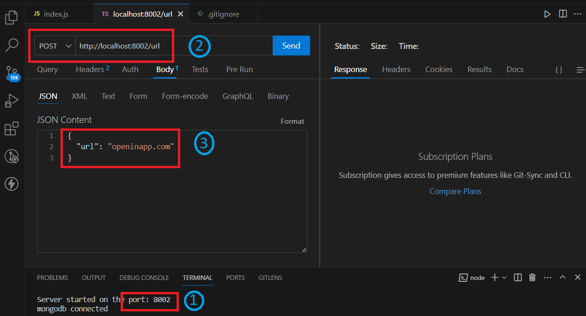
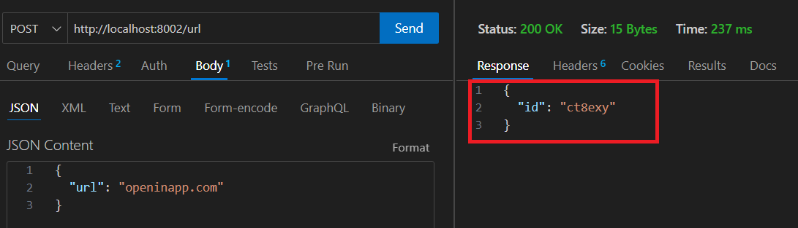
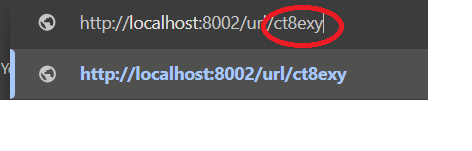
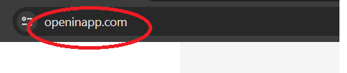

# URL Shortener

## Description
The code is written is Model-View-Controller(MVC) architecture
#### Total project explanation in 3 points
1. On POST request, takes a URL
2. Generates a short-id for the URL provided
3. On GET request, takes short-id and redirects the client to the original URL provided on POST request.

#### Technologies and Frameworks used
1. node.js: To build the server.
2. express.js: To ease the process of building the server.
3. mongoDB: Database to perform CRUD operations.

As shown in the figure:
  1. Server is made to run on PORT:8002
  2. A POST request is made to the server based on the PORT.
  3. URL of the website for which the short-id is to be generated is provided in the body. In this case it is:  'openinapp.com'

A short-id is generated for the URL provided. In this case, the generated short-id is:  'ct8exy'

On a web browser, request is made using short-id generated.

Based on the short-id, the client is redirected to the original URL provided while making a POST request. (openinapp.com)
